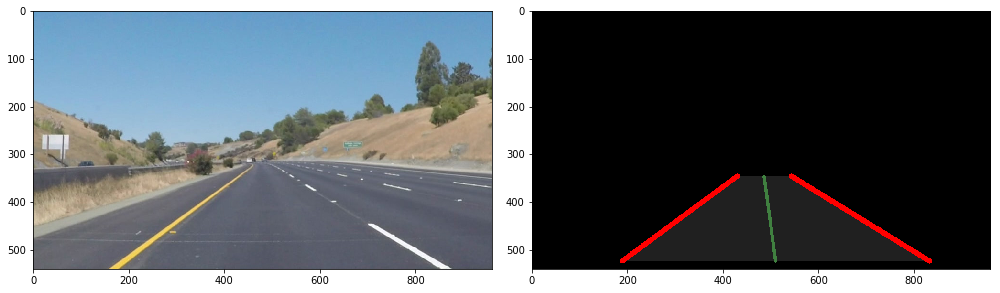

# **Finding Lane Lines on the Road** 

Overview
---

When we drive, we use our eyes to decide where to go.  The lines on the road that show us where the lanes are act as our constant reference for where to steer the vehicle.  Naturally, one of the first things we would like to do in developing a self-driving car is to automatically detect lane lines using an algorithm.

In this project you will detect lane lines in images using Python and OpenCV.  OpenCV means "Open-Source Computer Vision", which is a package that has many useful tools for analyzing images.  

To complete the project, two files will be submitted: a file containing project code and a file containing a brief write up explaining your solution. We have included template files to be used both for the [code](https://github.com/udacity/CarND-LaneLines-P1/blob/master/P1.ipynb) and the [writeup](https://github.com/udacity/CarND-LaneLines-P1/blob/master/writeup_template.md).The code file is called P1.ipynb and the writeup template is writeup_template.md 

To meet specifications in the project, take a look at the requirements in the [project rubric](https://review.udacity.com/#!/rubrics/322/view)

Writeup
---
## The pipeline
- [the notebook](P1.ipynb) a five step pipeline that will detect the left and right lane lines seperately, whereas lane line could be yellow-solid, white-solid, or white-dashed.
- In first step, the lanes are segmented from color images. We convert this images from [HSL] (hue, saturation, lightness) color space, we are using this to process it pixel by pixel. the preprocessed lightness channel using an adaptive histogram equalization to see changes in illumination to get separate masks for yellow & white lines.
[Pipeline: Yellow Mask](./examples/writeup_thresh_yellow.png)

The region of intrest is masked using trapezoid cut from bottom of image.

an edge image is obtained by applying Canny edge detection, reducing the lane lines to thin lines for further processing.

An image is passed to a problistic hough transform that detects line segments. 
A minimum line length segments in a valid distance are merged. Lines not agreeing with a valid range of slopes are discarded and the resulting lines are split by angle, extrapolated to a common length and averaged via their mean.

A video of the pipeline at work,

## shortcomings
- This processing pipeline only take single images in consideration
- It does'nt consider temporal and spatiotemporal correlations, and 
- A set of daylight images only taken with specific camera, for better evaluation we night images could have been good.
- Parameters are implicitly related to extrisic and instrisic camera parameters. eg. the angle filtering.
- As far as tracking is concerned (rather than detection), it must be noted that the algorithm requires a clear view at the lane lines in order to "known" them in the first place. there no missing lane lines that result in loss of tracking.
### Challenge video
- While working on challenge video, it was found that HSV values of yellow lines were similar to surrounding concrete in some of situations. 
It was solved using HSV color space with giving separate mask for yellow features only.
So, taking simple assumptions about the scenario may lead to unforeseeable failures when the implementation meets new environments.
Which makes accurate meassure of algorithm qaulity impossible to optimize.